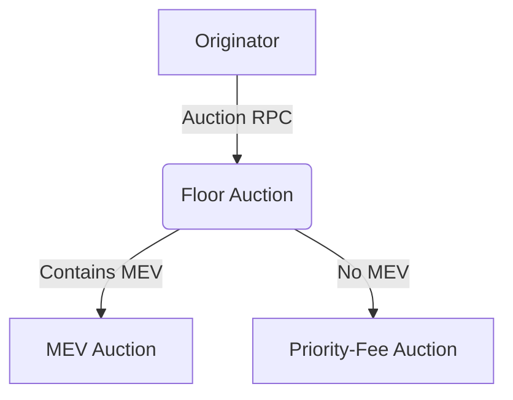

TL;DR: Conditional auctions keep the auctioneer in control and reduce bidder risk at the cost of more complex spam checks. In contrast, unconditional auctions are simpler but expose users to the risk of execution failure, increased latency and lack of finality. 

Infinite designs, infinite tradeoffs.

In today's Ethereum ecosystem, most user‐submitted transactions do not reside anymore in a public mempool. Instead, they're auctioned off to competing searchers or block builders before touching a block. That introduces new tradeoffs for both end users and participants downstream. In this post, we'll explore why these tradeoffs matter, dig into two core auction designs (Conditional vs. Unconditional), and then examine how different transaction types (Trigger vs. Priority-Fee) shape incentives.

**Why this matters:** As Ethereum usage scales, the old mempool first mentality is dead. Auction-driven order flow is now core to how transactions reach blocks, yet few people truly understand the engineering tradeoffs let alone the economic forces at play. In this post I'll explore those tradeoffs from an engineering viewpoint and focus specifically on retail user experience (ie users that click buttons in wallets).

---
## Two High-Level Auction Archetypes: Conditional vs. Unconditional

In my mind, there are two main auction types in ethereum: **Conditional** and **Unconditional**. Unconditional auctions are the simplest to understand. The purchaser buys the exclusive right to that transaction. When they buy the transaction, they pay for it; that's it. In contrast, a Conditional auction means the user will pay only if their transaction(s) get executed. There is much nuance to auction and pricing design, but from a high-level category theory, I believe all auction designs fit into these two categories.

| Aspect                          | Conditional Auction                                              | Unconditional Auction                                                |
| ------------------------------- | ---------------------------------------------------------------- | --------------------------------------------------------------       |
| Who lands it?                   | Auctioneer takes on atomicity risk                               | Winner of the auction takes on broadcast and atomicity risk          |
| Risk for bidder                 | Lower (no leg risk, can bid up to last moment)                   | Higher (must factor in execution and leg risk)                       |
| User finality                   | Can often cancel or get status updates pre-block                 | No pre-block visibility once sold                                    |
| Spam protection                 | Needs robust spam-filtering / rate limiting                      | Very little (auctioneer doesn’t keep transactions)                   |
| Permissioning required          | Optional (can stay permissionless with rational controls)      | Mandatory (buyer gets raw tx, so you must trust and monitor them)    |
| Capital efficiency              | Better (no up-front staking)                                     | Worse (likely requires stake or credit aka trust)                    |

### Unconditional Auction Tradeoffs

When we think about the system's design, we are giving away the entire transaction to the auction winner. The winner will have unfettered access to the transaction with no conditions or restrictions. Or, to put it another way, they have the right, but not the obligation, to execute the transaction along with their chosen arbitrage strategy. This leads to some common engineering tradeoffs. The auction will likely become closely aligned with the block period of the chain. However, the auction will always close before the block period ends to allow the winner to do something with the transaction. The back and forth between bidders, closing, notifying a winner, transferring the raw transaction, and adding some buffer will mean the auction must close many milliseconds before the block is built. This means that the bidder must take on some leg risk to account for the time between the auction closing and the building of the block. The bidder must also factor in execution risk, as the strategy may not actually work when it comes to executing in the block. Because the bidder needs to factor in these risks, they will likely bid less.

The benefits of this setup style are that the auctioneer doesn't need to worry about landing the transaction on-chain; this responsibility is passed to the transaction winner. It also means that the auctioneer doesn't need to worry about spam or rate limiting; they need to run a simple auction and nothing more.

One problem with an unconditional auction is that control of the transaction is lost as soon as you sell it. While this may seem obvious, it leads to some undesirable behaviour. Namely, the user gets no finality about their transaction. The user may wish to cancel the transaction but cannot because it has been sold unconditionally, so they must send a cancel transaction like they used to. The transaction may revert, but you can't prevent this from happening. The auctioneer may tell the user the transaction has been dropped, but then it lands on the chain many blocks later. In short, we're back to the world of unreliable mempools where your transaction is somewhere in the ether - except it's ten times worse because it's entirely private, and you're at the mercy of a single actor! You can mitigate this by broadcasting the transaction to the public mempool after a timeout period but it's not exactly a UX win. We end up with tradfi extraction and decentralised experience.

Assuming the auctioneer wants to set some acceptable behaviour parameters, they also need to implement external monitoring. For instance, if you want to check that users are not being front-run, you need to monitor all transactions you've sold and determine if they've been sandwiched. It's no easy task (EigenPhi has a full-time team!), but this also leads to another tradeoff: if you want to put any restrictions in place, you must have permissioning. There is no way you can have an unconditional auction without permissioning. This brings us to the next tradeoff: staking. Because the transactions are sold unconditionally, the buyer must pay for them before the transaction and block lands, meaning they must stake something somewhere beforehand. That means you have problems with capital efficiency and your ability to bid high volumes. If you want to bid 100 ETH, you need to stake first; alternatively, you have some form of credit agreement to allow the searcher to trade on margin. Either option furthers entrenches existing actors and increases trust and centralisation vectors.

### Conditional Auction Tradeoffs

Conditional auctions are ones where the trader sends their desired outcome to the auctioneer. This could be a sandwich bundle to a block builder or a backrunning transaction to an Order Flow Auction. The auctioneer keeps control of the transactions and is responsible for getting them on chain for both the transaction originator and purchaser. They could delegate some of these responsibilities to other teams—e.g., block builders and relays or OFAs and block builders. This control gives the provider the ability to dictate what is and isn't acceptable (e.g., no atomic frontrunning), but it also means that they are going to get a lot of heavy traffic, especially near the end of the block. The upside is that the auctioneer can continue to attempt to land transactions up to and beyond the block period. This means that the purchaser doesn't take as much risk when executing strategies. The downside is that you need to have some fairly robust spam protection systems in place; even if you have a permissioned system, the system will still need to handle periods of intense trading. The upside is that it's easier for the purchaser to "max bid" because they do not need to factor in any leg risk. The other nice thing about a conditional auction is that you get some level of transaction finality, meaning that you can offer the end user some guarantees and visibility about what's happening i.e users can be offered cancellations with reasonable levels of accuracy and timeliness.

---

## Two Transaction Types

There are two main types of transactions when it comes to MEV: Trigger Transactions and Priority-Fee Transactions.

### Trigger Transactions

Trigger Transactions are those that a user places that create an arbitrage opportunity. They could be a swap that dislocates the price in a pool or an oracle update. The value for the arbitrageur is in the signal it provides.

### Priority-Fee Transactions (AKA Everything Else)

These are standard user actions, minting NFTs, sending eth, etc., that do not create an arbitrage opportunity. The only value they have is what's available on the priority fee. The total amount is the `priority fee * gas used`. You can only know the exact amount when it is included in a block, as the gas used may change depending on its position in the block, but in reality, you have a great idea of what it's worth for each block.

---

## Different Incentives

"Show me the incentive and I'll show you the outcome." – Charlie Munger.

The different types of transactions have different incentives for various actors. Personally, I think most users typically want fast/instant inclusion. They hit the confirm button and want their transaction to be included in the same block. They don't want to see a spinning wheel for 30s. 

### Trigger Transactions

When a searcher has a Trigger Transaction available to them, they behave in a way that will benefit them the most. They are the very definition of rational econ actors. The problem with Trigger Transactions is that they suffer from **time sensitivity**; opportunities can change rapidly. What was an opportunity may be lost within a matter of nanoseconds. The searcher is incentivised to land the opportunity for as long as it is profitable to them.

The way in which an auction is designed has a huge impact on incentives and behaviors. Let's look through some tradeoffs and see what sort of impact that would have on auction revenue and searcher profits. First, let's assume that the auction gives a searcher exclusive rights to a transaction and that searchers bid on those transactions in a closed-bid, ascending-timed auction (i.e., the highest bidder wins when the auction is closed).

An auctioneer will sell the right to do something with a transaction. Varying levels of information from Trigger Transactions are made available for searchers to bid on. For instance, the auction may only provide `to` and `data` fields (similar to the ad-tech world, where limited information about a user is auctioned to advertisers in real time to enable behavioural targeting). In practice, most provide everything except the signature.

#### Conditional Auctions (Trigger Transactions)

 Conditional Auctions allow the auctioneer to keep more control of what's going on. For example, they tend not to enable atomic frontrunning. For Searchers, it's a clear, simple structure that everyone understands. The searcher is only charged if their opportunity is landed. For instance, imagine an oracle update that momentarily misprices DAI/ETH by 0.5%. A searcher using a conditional auction can bid extremely aggressively because they won't pay unless their back-run bundle lands. They might bid almost all their profit to ensure they capture that fleeting arbitrage, knowing they only pay if executed. Because of the conditionality, the searcher can continue sending bids beyond the block period, and they do not need to factor in the risk of reverts or failing to land. Consequently, they are more likely to bid the maximum. Trigger Transactions can also experience faster inclusion during periods of block-space contention. These users will benefit from having their effective priority fee increased because the searcher subsidises it. 

#### Unconditional Auctions (Trigger Transactions)

Searchers are already highly proficient at getting transactions into blocks. They run latency-optimised infrastructure and are highly competent. Unconditional auction designs leverage this expertise. The same holds true as it does for conditional auctions: the searcher is subsidising inclusion. But the problem is that once the transaction has been sold, the searcher isn't obliged to land the transaction. So, if the opportunity has gone away, there's nothing in it for the searcher to land the transaction. They could hold onto it forever, waiting patiently for the opportunity to arise again, or they may drop it. A user could submit a transaction and forget about it! With unconditional auctions, we see a decentralised experience with trad-fi style extraction. Imagine the same scenario: an oracle update that momentarily misprices DAI/ETH by 0.5%. A searcher using an unconditional auction needs to factor in several risk factors; their strategy might not land, or it may go stale and become unprofitable. The searcher has more work to do because of the auction timings. Consequently, they are more likely to bid less than in a conditional auction. 

### Priority-Fee Transactions

These transactions contain value that block builders can extract. A simple eth transfer with a 1 gwei priority fee means up to 21k gwei is available (i.e., 21k gas × 1 gwei). This can happen when the block builder has a transaction exclusively; all things being equal, they can keep all 21k gwei and give nothing to the block proposer. Alternatively, they can give some back to the originator or an intermediary in the transaction supply chain. In theory for retail users, the priority fee is there as a tip to fall back upon during times of block-space contention. In reality a retail user is not specifying a high priority fee to get top of block. They are simply blindly smahing the max button in the vane hope of fast inclusion. If the user specifies 1 gwei prioirty fee, but half of it is being extracted along the way before it reaches a block, the effective tip becomes 10.5k gwei. Assuming block builders are rational and all other things being equal, the transaction that has had no value extracted from it will be chosen over the one that have - because the effective value to the proposer is higher (i.e., it enables the block builder to bid more to win the block).

#### Conditional Auctions (Priority-Fee Transactions)

In its simplest form you get a rebate when your transaction lands on chain. Many block builders offer a `refundPercent` that will give back a proportion of the priority fees back to the originator. This is conditional on the transaction (or bundle) landing and the block builder winning the block.

#### Unconditional Auctions (Priority-Fee Transactions)

With an unconditional auction on priority fees, the purchaser is reducing the effective gas tip on the transaction and making it less attractive. Remember that an unconditional auction gives the entire transaction exclusively to the purchaser. This leads to some perverse incentives. Let's say you purchase a transaction with an effective priority fee of 21k gwei for 10.5k gwei. What this gives you is 21k gwei worth of fees for you to use as a subsidy for your other transactions. The most logical thing to do is to accumulate transactions on the cheap and use them to subsidise other trades. Consequently, transaction inclusion is adversely affected for priority fee transactions, assuming no other systems exist.

---

## One Auction to Serve Them All?

It is impossible to design an OFA that perfectly handles both types of transactions and balances user-experience tradeoffs. Optimising for value extraction risks degrading the user experience. Optimising for users may leave MEV on the table or disincentivise proposer participation. 

There is no one true design.

Even once you know what you want to optimise for, you still have a bunch of tradeoffs. The OFA that has a single transaction per block has an entirely different set of tradeoffs compared to one that has 50. The type of OFA will also dictate the design decisions and tradeoffs for that auction. There is no point in trying to compare CoW Swap with MEV Blocker.

Personally, I believe the main goal of an OFA should be to optimise for the user experience of order-flow originators. For me that primarily means ensuring that execution speed is aggressively reduced. The goal should be to ensure inclusion within the same block for the majority of users. There is no reason why most transactions should not land in the same block.

Consequently, I think multiple strategies would be necessary to design an OFA that meets the needs of most users.

### Dynamic Routing

Transactions could be dynamically routed to different OFAs based on the transaction type. There's no point in auctioning off an NFT claim to someone interested in CEX–DEX arb. However, the only way to know the value of something is to auction it! So how could you do this? I would first create a two-phase auction to indicate what type of transactions we're dealing with. Then, I would use that information to route the transaction to an appropriate auction.

#### Priority Fees vs. MEV

First, you want to know if any participant is willing to pay more than the total priority fees available on the transaction. This could be as simple as asking the question, "Is there any MEV here?" or as simple as asking for the first bid. If it's over the floor price, it becomes an MEV auction; otherwise, it's a priority fee recovery. 

To encourage early bidding, one could incentivise the first bidder with a discount on subsequent bids.

Obviously, there's a timing issue here: You may not know if there's MEV available until very late in the block. You're also leaking information both from an EV-signal point of view and from a searcher point of view. So, what else could you do instead? I think this approach is probably too complicated and not worth it.

### Leveraging Block Builder Algorithms

One of the social contracts that block builders offer is that they promise not to exploit your order flow (and not to unbundle your bundles). They have good incentives not to do this because they know you'll stop sending order flow to them if they do. This setup requires monitoring and business development, but it works well. The downside is that it leads to centralisation around big block builders, as we've seen over the last couple of years with the entrenchment of Beaver and Titan. An alternative to this is Builder Net, which utilises TEEs to ensure that block builders are focused on algorithms rather than being malicious. The main thing to think about is how we can leverage the block builder game to the advantage of the OFA.

#### Send Bundle and Refund Percentage

The OFA can use sendBundle to ensure/maximise the chance of the transaction landing. If desired, the OFA could specify the refund percentage to indicate how much of the priority fee they wish to get back. This, in effect, becomes our floor price. You can then sell the transaction using any method you wish.

**Why would this work?**  
We would leverage the block builders' internal algorithms to benefit the searcher and OFA. Let's walk through it.

In this design, the OFA asks for a 40% refund on any priority fee from the builder; when a searcher wins, they must top up above 40% to win the builder's gas auction. Builders thus see a clear floor (40%) but know they can benefit if the searcher pays more. 

This design could work today without any changes from builders or searchers. 

A better option for an OFA would be to run two parallel conditional auctions: one with block builders for priority fees and one with searchers for MEV. 

### The priority fee block builder auction

The problem with the priority fees is that you want to extract maximum value without impacting user experience (i.e. maintaining the same block inclusion). The difficulty is that to maximise value extraction, you need to offer exclusivity on the thing you're selling. In practice, you can not run an English auction without exclusivity. The tradeoff is that your inclusion takes a hit. If you sell the transaction to Beaver and Titan wins the block, you've delayed the user's transaction. If you can not run an English auction, price discovery is difficult. 

You need a way for all "trusted" block builders to receive the transaction and not bid away all of the priority fees to win the block. What you want is a way for your "trusted" block builders to still win blocks while giving you the biggest refund. In my opinion, access to order flow shouldn't be "the game" for block builders. As such, the refund percentage should trend towards higher over time. There will, of course, be a ceiling at which block builders will stop accepting order flow. As it stands, where a block builder wins the block by paying more to the proposer, paying more for order flow than it's worth is ridiculous. Would they pay up to the total priority fee available, assuming the cost of inclusion is zero? Yes, rationally, they should. Now, the cost of inclusion isn't zero. There's added compute for simulations and increased latency that needs to be accounted for, but the starting point should be a full refund.

With these attributes in mind, we can think of a better auction design. Something like a uniform sealed bid on refund percentage would warrant further investigation. The refund percentage would be calculated early on in the block building period say 10s into the block, the block builders would have a reasonable picture of how "busy" the block will be at that point. Information about how much gas the OFA has collected can then be shared to help the block builders make a judgement. You can then collect sealed bids from everyone and offer the max bid back to all block builders at that refund percentage for the entirety of the order flow available for that block. Further research and dynamics can be added to hide information to prevent collusion, but the rough idea holds. Block builders would then opt-in at that refund percentage for that block, and payment would be made to the OFA conditionally on them winning the block.

From an engineering and UX perspective, this means that any order flow received by the OFA can continue to be forwarded to each block builder until the end of the block period. Thus, you continue to receive the benefits of a conditional auction without having to worry about some of the downsides, namely landing transactions and high bid frequency.

### MEV auction

The majority of retail user transactions do not create an arbitrage opportunity, but when they do, you want to make sure you can maximise your profit (and potential user rebates). With this in mind, I think running a standard English auction after the priority fee auction with conditional payment on inclusion makes the most sense. There is, in effect, a floor price to the transaction that the searcher needs to beat, and we can rely on the block builders to take care of it. This is how most OFAs currently work. 

## Summary

Ethereum’s transition from a public mempool model to auction-based order flow has fundamentally reshaped transaction processing. At the heart of this shift lie two dominant auction models: conditional and unconditional. Each introduces a distinct set of engineering challenges, economic incentives, and UX considerations.

Conditional auctions grant more control to the auctioneer and improve finality for users, making them well-suited for latency-sensitive and user-focused experiences. Unconditional auctions, while simpler and potentially more efficient for high-performance searchers, introduce execution risk and reduce user transparency. Layered atop this are different transaction types each pulling incentives in different directions.

## Conclusion

There is no one-size-fits-all design for Order Flow Auctions. Engineering these systems requires navigating a complex web of tradeoffs between latency, trust, centralisation, finality, and value extraction. Designing a successful OFA means aligning incentives across users, searchers, block builders, and proposers—while not losing sight of what makes Ethereum valuable: neutrality, permissionlessness, and decentralisation.

Going forward, expect to see more nuanced, hybrid designs that route transactions based on type, leverage conditional refunds, and incorporate smarter mechanisms for inclusion guarantees. Like gas pricing before EIP-1559, this area is ripe for innovation and iteration.

For engineers working in this space, the job is not just to optimise auctions—it’s to ensure that users aren’t left staring at spinning wheels, unsure if their transactions have vanished into a dark forest of MEV.

---

## References

- [Transaction Fee Mechanism Design in a Post-MEV World](https://arxiv.org/abs/2304.04981)
- [Ethereum Research: Inclusion Lists](https://ethresear.ch/t/unconditional-inclusion-lists/18500)
- [SUAVE: A New Approach to MEV Infrastructure](https://www.flashbots.net/blog/suave-introduction)
- [EIP-1559 and Ethereum's Fee Market](https://notes.ethereum.org/@vbuterin/eip_1559_explained)
- [Everything You Need To Know About Order Flow Auctions](https://www.monoceros.com/insights/order-flow-auctions)
- [Order flow, auctions and centralisation II – Order Flow Auctions](https://writings.flashbots.net/order-flow-auctions-and-centralisation-II)
- [Order flow auctions' bumpy road to credibility](https://www.doseofdefi.com/p/order-flow-auctions-bumpy-road-to)
- [Censorship Resistance in On-Chain Auctions](https://arxiv.org/abs/2301.13321)
- [Indicative Bidding and a Theory of Two-Stage Auctions](https://www.asc.ohio-state.edu/ye.45/Research/Published-Papers/Ye-GEB2007.pdf)
- [Selective entry and auction design](https://www.sciencedirect.com/science/article/pii/S0167718715000375)
- [Contest Architecture](https://doi.org/10.1016/j.jet.2005.08.003)
